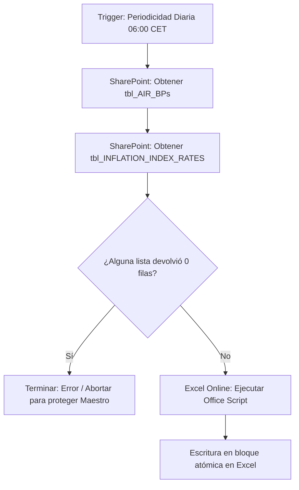

# SORA - Proceso Automatizado de Reconstrucción de Fichero Maestro de Inflación

Este proyecto contiene el flujo automatizado en la nube de Power Automate y el script de Office (TypeScript) para la sincronización diaria de datos maestros de inflación en Excel a partir de listas de SharePoint.

---

## 📌 Arquitectura y Componentes

### 1. Script de Office
* **Fichero**: [`Rebuild_SORA_Inflation_Index.ts`](./Rebuild_SORA_Inflation_Index.ts)
* **Objetivo**: Cruce en memoria $O(1)$ con `Map` entre `tbl_AIR_BPs` y `tbl_INFLATION_INDEX_RATES`.
* **Columnas de salida exactas**:
  1. `PVC_Business_Partner`
  2. `BP_Desc`
  3. `Index_Code`
  4. `Inflation_Index_ID`
  5. `Applicable_Year`
  6. `Rate`
* **Limpieza y escritura**: Limpia el rango usado inferior a los encabezados y realiza una escritura en bloque (`targetRange.setValues()`) en una sola operación atómica.

---

### 2. Flujo de Power Automate
* **Nombre**: `SORA - Rebuild Inflation Index Master`
* **Entorno**: `S_CFA-RNC_Dev` (`https://dev-s-cfa-rnc.crm4.dynamics.com/`)
* **Solución**: `SORA_Solution`
* **Programación**: Diaria a las **06:00 CET** (`Romance Standard Time`).
* **Parámetros SharePoint**:
  * Paginación: Activada con umbral $\ge 100\,000$.
  * Top Count: $5\,000$.
  * `$select`: Solo campos requeridos.
* **Fichero Excel destino**:
  * Sitio: `https://amadeusworkplace.sharepoint.com/sites/CFA-RCTeamsite`
  * Biblioteca: `Contract Fulfillment`
  * Ruta: `1. AIR/OPM 03. Operations/05. Contractual Conditions Harmonization project/Pricing file transformation/Master data/SORA_Inflation_Index_Values.xlsx`

---

## 🚀 Pasos para completar la puesta en marcha

### Paso 1: Pegar el Office Script en el libro Excel
1. Abre el libro [`SORA_Inflation_Index_Values.xlsx`](https://amadeusworkplace.sharepoint.com/sites/CFA-RCTeamsite) en **Excel Online**.
2. Ve a la pestaña **Automatizar** > **Nuevo script**.
3. Pega el código de [`Rebuild_SORA_Inflation_Index.ts`](./Rebuild_SORA_Inflation_Index.ts).
4. Guarda el script con el nombre exacto: `Rebuild_SORA_Inflation_Index`.

### Paso 2: Activar y enlazar conexiones del Flujo en Power Automate
1. Entra en [make.powerautomate.com](https://make.powerautomate.com/) y selecciona el entorno **`S_CFA-RNC_Dev`**.
2. Ve a **Soluciones** > **`SORA_Solution`** > **Flujos de nube** > abre **`SORA - Rebuild Inflation Index Master`**.
3. Revisa y asigna tus conexiones en las dos referencias creadas:
   * **SharePoint Online SORA** (`rmc_sharedsharepointonline_sora`)
   * **Excel Online SORA** (`rmc_sharedexcelonlinebusiness_sora`)
4. Haz clic en **Activar (Turn on)** en la barra superior del flujo.
5. Haz una ejecución de prueba manual (**Probar > Manualmente**) para validar la primera carga completa.
